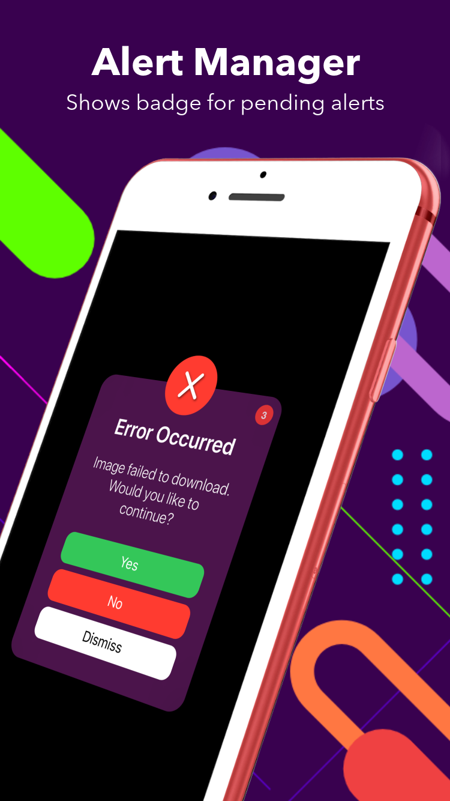
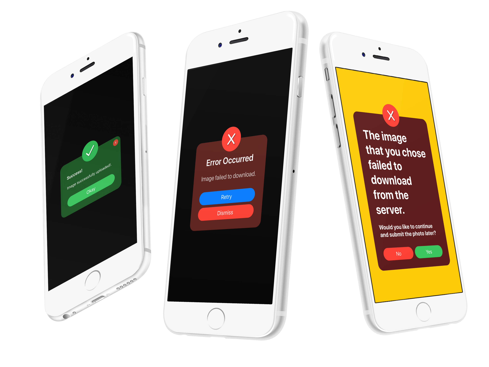

<div align = "center">

</div>

<p align="center">


</a>
</p>

# Alert

Alert is a customizable alert that acts like the native UIAlertController.  
Alert's layout, styling, and sizing is easy to change.
The main feature of Alert is its queue, that instead of canceling
other incoming alerts (like UIAlertController does) will show the next one when the first alert is dismissed.
It does this by showing a small red badge in the upper right hand corner.

<div align = "center">



</div>

## Usage
Download the example project from this repo to see how simple Alert is to use.  

## In the App Delegate, register the observer under didFinishLaunchingWithOptions:
```swift
Alert.shared.setupAlertChangeObserver()
```

- Simple Alert

```swift
let alert = AlertViewController(image: nil, title: "Error Occurred", subtitle: "Image failed to download")
let dismissButton = AlertButton.dismiss(handler: nil)
alert.buttons = [dismissButton]
Alert.shared.addAlert(alert, on: self)
```

- Simple Alert + Rounded Button:

```swift
let alert = AlertViewController(image: nil, title: "Error Occurred", subtitle: "Image failed to download")
let dismissButton = AlertButton.dismiss(handler: nil)
alert.buttons = [dismissButton]
alert.buttonHeight = 40
alert.cornerRadius = 20
Alert.shared.addAlert(alert, on: self)
```

- Simple Alert + Multiple Buttons + Rounded:

```swift
let alert = AlertViewController(image: nil, title: "Error Occurred", subtitle: "Image failed to download")
let yesButton = AlertButton.yes(handler: nil)
let noButton = AlertButton.no(handler: nil)
alert.buttons = [noButton, yesButton]
alert.buttonHeight = 40
alert.cornerRadius = 20
Alert.shared.addAlert(alert, on: self)
```

- Vertical Buttons:

```swift
alert.buttonLayout = .vertical
```

- Change Vibrancy Background Color:

```swift
alert.vibrancyColor = .red
```

- Title & Subtitle Font:
```swift
alert.titleFont = UIFont.systemFont(ofSize: 40, weight: .bold)
alert.subtitleFont = UIFont.systemFont(ofSize: 20, weight: .bold)
```

- Title & Subtitle Color:
```swift
alert.titleColor = .blue
alert.subtitleColor = .green
```
