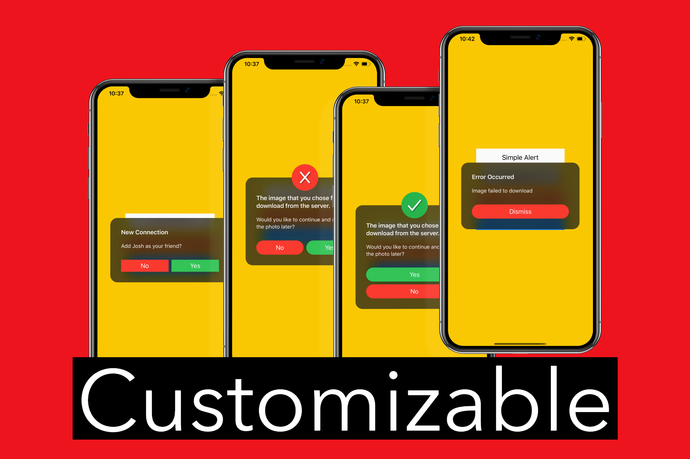

<div align = "center">

</div>

<p align="center">


</a>
</p>

# Alert

Alert is a customizable alert that acts like the native UIAlertController.  
Alert's layout, styling, and sizing is easy to change.
The main goal of Alert is to eventually create an alert queue, that instead of canceling
queued alerts (like UIAlertController does) will show the next one when the first alert is dismissed.

## Usage

- New Alert

```swift
let alert = AlertView(image: nil, title: "New Connection", subtitle: "Add Josh as your friend?")
let yesButton = AlertButton(title: "Yes", color: .systemGreen, cornerRadius: 20) { button in
    // Do Yes Button Action.
}
let noButton = AlertButton(title: "No", color: .systemRed, cornerRadius: 20) { button in
    alert.dismiss()
}
alert.buttons = [noButton, yesButton]
alert.present(on: self.view)
```

<div align = "center">

</div>
